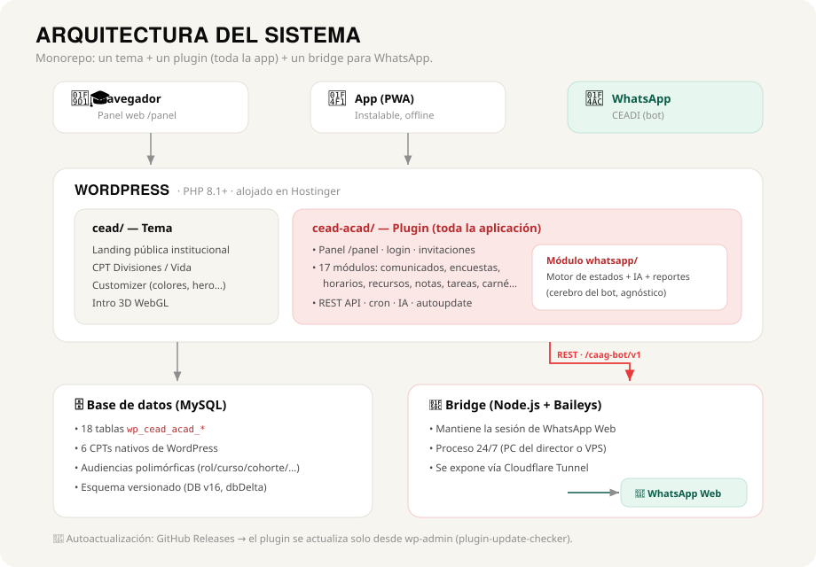

# 🛠️ CEAD Académico — Wiki técnica

> Documentación técnica del sistema del **Centro Educativo de Alto Desempeño "Félix de Guarania"** (CEAD).
> DB schema **v17** · Requiere WordPress 6.4+ y PHP 8.1+.

<!-- La versión del plugin NO va escrita acá: el pie de /wiki la imprime desde
     CEAD_ACAD_VERSION. Escrita a mano se quedó en 0.44.1 mientras el pie de la
     misma página decía 0.59.0. `bin/check-symbols.php` ahora lo detecta. -->

Esta wiki está pensada para quien quiera entender **cómo está construido** el proyecto: arquitectura, módulos, modelo de datos, el bot, seguridad y despliegue. Para la guía de uso en lenguaje simple, ver **[Wiki del usuario](WIKI-USUARIO.md)**.

> Ambas wikis se sirven online (solo lectura) en **`/wiki`** y **`/wiki/tecnica`**, renderizadas por el plugin desde estos mismos archivos Markdown (ver §5, módulo `wiki/`).

---

## 1. Resumen del proyecto

CEAD Académico es la plataforma digital de una institución educativa. Resuelve, en un solo sistema, toda la operación académica y de comunicación del colegio:

- **Gestión académica**: alumnado, cursos, roster (inscripciones), calificaciones/boletín, horarios y tareas.
- **Comunicación**: comunicados con audiencia segmentada, encuestas, eventos/calendario, recursos pedagógicos.
- **Canal de WhatsApp (CEADI)**: bot conversacional con IA y notas de voz para alumnado y staff.
- **Administración**: panel wp-admin con métricas, importadores CSV/XLSX, buzón de reportes y autoactualización.

No es un LMS genérico: está hecho a medida para el flujo real de la institución, con roles, permisos y audiencias propios.

---

## 2. Arquitectura general

El repositorio es un **monorepo** con tres componentes que cooperan:


*Vista general: los tres canales entran a WordPress (tema + plugin); el plugin habla con la base de datos y, para WhatsApp, con el bridge.*

El mismo diagrama en texto:

```
┌─────────────────────────────────────────────────────────────┐
│                      WordPress (PHP 8.1+)                     │
│                                                              │
│   cead/ (tema)            cead-acad/ (plugin)                │
│   ───────────             ──────────────────                │
│   Landing pública    +    Toda la lógica académica + panel   │
│   (CPT Divisiones/        (/panel, /login), bot, importadores│
│    Vida, Customizer)      REST API, cron, autoupdater        │
└───────────────────────────────┬──────────────────────────────┘
                                 │  REST  /wp-json/caag-bot/v1/*
                                 │  (header X-Caag-Token)
                                 ▼
                  ┌───────────────────────────────┐
                  │   Bridge Node.js (Baileys)    │
                  │   WhatsApp Web ↔ WordPress     │
                  │   Corre en una PC/servidor     │
                  │   expuesto vía Cloudflare Tunnel│
                  └───────────────────────────────┘
```

- **`cead/`** — Tema clásico de WordPress (PHP plano, sin frameworks). Es la cara pública del sitio (landing institucional).
- **`cead-acad/`** — Plugin modular que contiene **toda** la aplicación: portal `/panel`, autenticación, módulos académicos, bot y administración.
- **`cead-acad/bridge/`** — Servidor Node.js independiente que conecta WhatsApp Web (librería [Baileys](https://github.com/WhiskeySockets/Baileys)) con WordPress vía REST.

La separación tema/plugin es deliberada: el tema puede cambiar sin perder datos ni lógica, y el plugin funciona incluso con otro tema activo (encola estilos de fallback).

---

## 3. Stack tecnológico

| Capa | Tecnología |
|------|-----------|
| Backend | PHP 8.1+ (usa `match`, enums, named args), WordPress 6.4+ |
| Base de datos | MySQL/MariaDB (tablas custom `wp_cead_acad_*` + CPTs nativos de WP) |
| Frontend panel | PHP server-rendered + CSS plano + JS vanilla (sin build step) |
| App móvil | PWA (service worker, manifest, instalable, offline básico) |
| Bot | Node.js + Baileys 7 (WhatsApp Web) + nginx/HTTPS o Cloudflare Tunnel |
| IA del bot | API compatible con OpenAI (DeepSeek por defecto, configurable) + tool calling nativo |
| Voz | Transcripción de notas de voz (STT) en el bridge |
| Imágenes | Lectura por modelo con visión (opcional, formato multimodal OpenAI) |
| Documentos | Extracción de texto de PDF / `.docx` / `.odt` en el servidor (opcional) |
| Autoupdate | [plugin-update-checker](https://github.com/YahnisElsts/plugin-update-checker) + GitHub Releases |
| CI | GitHub Actions (PHPUnit + empaquetado y publicación de releases) |

Decisión de diseño: **cero dependencias pesadas de build**. No hay Webpack, Tailwind ni Composer en runtime para el frontend; el lector de XLSX, por ejemplo, está hecho a mano con `ZipArchive` + `SimpleXML`.

---

## 4. El tema (`cead/`)

Tema clásico portado de un HTML+PHP original. CSS plano, sin Tailwind.

- **`front-page.php`** orquesta la landing por secciones (`template-parts/sections/`): intro animada, hero, valores, cita, divisiones, marquesina, vida estudiantil, admisión.
- **CPTs propios**: `cead_division` (bachilleratos) y `cead_vida` (vida estudiantil), con seeders que insertan contenido inicial al activar.
- **Customizer**: colores de marca, hero, valores, cita, marquesina, admisión, footer/contacto — todo editable sin tocar código.
- **Formulario de contacto**: `wp_mail()` + nonce, con log de respaldo en `uploads/`.
- **Versión**: `1.4.0` (incluye intro 3D WebGL en la landing).

---

## 5. El plugin (`cead-acad/`)

Arquitectura modular. `cead-acad.php` es el bootstrap: define constantes, hace `require_once` de cada módulo y arranca `Cead_Acad_Plugin::instance()->boot()` en `plugins_loaded`.

### Módulos

| Módulo | Responsabilidad |
|--------|-----------------|
| `auth/` | Login/registro estilizados, invitaciones por token, reset de contraseña, suspensión de usuarios |
| `courses/` | CPT de cursos, taxonomías (cohorte/grado), roster usuario↔curso |
| `broadcasts/` | Comunicados con audiencia polimórfica, targeting, read receipts, feed por usuario |
| `surveys/` | Builder de encuestas (6 tipos de pregunta), ventana de fechas, modo anónimo, export CSV |
| `schedule/` | CPT de eventos, feed por audiencia, export iCal (suscripción Google/Apple) |
| `resources/` | CPT de recursos (archivo o URL), taxonomías materia/tipo, ACL por audiencia |
| `grades/` | Tabla de calificaciones por (alumno × materia × periodo), boletín |
| `panels/` | CPT de tareas del delegado (estado/prioridad/vencimiento) + frontend |
| `importers/` | Importación guiada CSV/XLSX (alumnado, notas, cursos, eventos) en 3 pasos |
| `whatsapp/` | Bot CEADI: motor de estados, IA, broadcasting, cron, REST, admin (11 clases + bridge) |
| `account/` | Perfil, carné digital con QR, verificación de WhatsApp |
| `pwa/` | Service worker, manifest, instalación como app, offline |
| `notifications/` | Centro de notificaciones in-app (campana): no leídos, próximos eventos, tareas |
| `faq/` | Preguntas frecuentes configurables |
| `wiki/` | Sirve esta documentación en `/wiki` y `/wiki/tecnica` (solo lectura, desde los `.md` empaquetados; Markdown→HTML con Parsedown) |
| `updates/` | Autoactualización desde GitHub Releases (ver §11) |
| `admin-ui/` | Escritorio wp-admin con estética CEAD y métricas |

### Capas transversales (`includes/`)

`class-cead-acad-plugin.php` (orquestador), `class-cead-acad-activator.php` (`dbDelta`, roles, seed), `class-cead-acad-capabilities.php` (roles y caps), `class-cead-acad-rewrites.php` (rutas frontend), `class-cead-acad-template-loader.php` (override de templates desde el tema), `class-cead-acad-audit.php` (audit log), `class-cead-acad-email.php` (emails con branding), `helpers.php` (utilidades globales).

### Convenciones de código

| Tipo | Convención |
|------|-----------|
| Funciones globales | `cead_acad_*` |
| Clases | `Cead_Acad_*` (PascalCase) |
| Tablas | `{$wpdb->prefix}cead_acad_*` |
| Meta keys privadas | `_cead_acad_*` |
| Clases CSS / Options / Cron | `cead-acad-*` / `cead_acad_*` |
| Text-domain | `cead-acad` |
| REST namespace | `caag-bot/v1` |

---

## 6. Modelo de datos

Dos familias de datos: **CPTs nativos** de WordPress y **tablas custom**.

### CPTs

`cead_acad_course`, `cead_acad_broadcast`, `cead_acad_event`, `cead_acad_resource`, `cead_acad_survey`, `cead_acad_task` — con sus taxonomías (cohorte, grado, categoría de comunicado, materia, tipo de recurso).

### Tablas custom (`wp_cead_acad_*`)

Se crean/actualizan idempotentemente con `dbDelta()` cuando sube `CEAD_ACAD_DB_VERSION` (actual: **17**).

| Grupo | Tablas |
|-------|--------|
| Académico | `invitations`, `roster`, `grades`, `import_jobs`, `audit_log` |
| Comunicación | `audiences` (polimórfica, compartida por comunicados/encuestas/eventos), `broadcast_reads`, `survey_questions`, `survey_responses`, `survey_answers` |
| Bot WhatsApp | `wa_session`, `wa_registry`, `wa_state`, `wa_messages`, `wa_reports`, `wa_suggestions`, `wa_scheduled`, `wa_logs` |

**Patrón clave — audiencias polimórficas**: una sola tabla `audiences` modela "a quién va dirigido" para comunicados, encuestas y eventos, con tipos `all / role / course / cohort / user`. Eso permite targeting flexible sin duplicar lógica.

Las inserciones académicas son **idempotentes** (UNIQUE keys), de modo que reimportar un CSV actualiza en vez de duplicar.

---

## 7. El bot CEADI (módulo `whatsapp/`)

### Arquitectura interna

```
Bridge (Node/Baileys) ──POST /caag-bot/v1/incoming──► WA_REST
                                                         │
                                                         ▼
                                                     WA_Engine  ←── WA_AI (IA opcional)
                                              (máquina de estados por teléfono)
                          ┌──────────────────────┼───────────────────────┐
                          ▼                      ▼                        ▼
                       WA_Store            WA_Identity            Datos del plugin
                       (tablas wa_*)       (phone→user_id)        (Schedule, Broadcasts…)
                          ▲
                  WA_Broadcaster ◄── WA_Cron ──► WA_Bridge_Client ──► bridge /api/send*
```

- **`WA_Identity`** normaliza el teléfono a **E.164 estricto** (código de país configurable, default `595`) y resuelve `phone → user_id`. Con match: experiencia personalizada; sin match: modo general.
- **`WA_Engine`** es una **máquina de estados** por número (estado actual + contexto JSON en `wa_state`). Maneja menús, flujos multi-paso y atajos (`-AA`, `-AE`).
- **`WA_AI`** (opcional) interpreta lenguaje natural con **tool calling nativo**: la IA decide qué función del sistema disparar (horarios, comunicados, reportes…) o responde con la base de conocimiento/FAQ. Proveedor libre compatible con OpenAI. Las acciones de staff requieren **aprobación humana** antes de ejecutarse.
- **Notas de voz**: el bridge descarga el audio y lo **transcribe** (STT) antes de pasarlo al engine; por eso el timeout en audios es mayor.
- **Imágenes** (opcional, *CEADI · IA → Imágenes*): la foto viaja en base64 hasta el modelo como bloque `image_url` (formato multimodal de OpenAI). Requiere un modelo que acepte imágenes; se puede configurar uno distinto del de texto. Tope 4 MB, sin reintento (una llamada con imagen no entra dos veces en lo que el bridge espera). Adjuntar la foto a un comunicado o artículo es un camino aparte y no depende de esto.
- **Documentos** (opcional, *CEADI · IA → Documentos*): `WA_Docs` extrae el texto **en el servidor** (no se manda el archivo a la IA) y lo inyecta como contexto. `.docx`/`.odt` son ZIP con XML adentro; el PDF se lee juntando los operadores `Tj`/`TJ` de sus streams. Un **PDF escaneado no tiene texto** (haría falta OCR): se avisa y se pide la foto. `.doc`/`.xls` binarios se rechazan en el bridge con instrucciones para convertirlos.
- **Proveedor de respaldo** (opcional, *CEADI · IA*): un segundo endpoint/modelo/key. Si el principal falla, el mismo mensaje se reintenta contra el otro y la persona no se entera. **Cargar el respaldo apaga el reintento contra el principal**: no se acumulan. El bridge espera 45s (`WP_TIMEOUT_MS`) y el turno tiene 38s de presupuesto (`PRESUPUESTO_SEG`); con 18s por intento, principal + respaldo son ~36.6s y entran, mientras que reintentar además el principal daría ~55s y el bridge cortaría antes — la persona no recibiría nada, peor que la caída. El respaldo tiene **sus propios tres niveles** (`cead_acad_wa_ai2_model_n1/n2/n3`, vacíos caen a `cead_acad_wa_ai2_model`) y no hereda los del principal: pedirle un modelo que ese proveedor no tiene convertiría la caída del principal en una caída total. Sin niveles propios se comportaba como el agujero clásico de una arquitectura con respaldo — el principal cae a mitad de `cargar_nota` y esa nota termina cargada por el modelo chico del respaldo, con un humano aprobando «un 4 a Ana» porque se lee bien. En el failover **solo cambia `model`**: personalidad, reglas de idioma y seguridad, historial y herramientas viajan dentro de `messages`, que es parte del pedido y no del proveedor. Excepción conocida: con imagen adjunta el respaldo usa su modelo general, así que ése tiene que aceptar imágenes para que las fotos sigan funcionando durante una caída. Un **400 no dispara el respaldo**: casi siempre es un parámetro que ese modelo no acepta, el otro lo rechazaría igual, y `call()` ya tiene sus propias salidas para el 400 (bajar `max_tokens`, pasar a modo JSON).
- **Aviso de caída**: cuando un proveedor falla, se le manda un WhatsApp al número de dirección (`cead_acad_wa_director_phone`) con la causa y el arreglo. `diagnostico()` mira el código **y el cuerpo**, porque no son equivalentes: DeepSeek avisa el saldo agotado con un 402 y OpenAI con un 429 idéntico a «demasiados pedidos», que se arregla esperando. Está limitado a **un aviso por causa cada 30 min** (un proveedor caído falla en cada mensaje de cada alumno; sin freno serían cientos de envíos, y en Baileys eso es lo que hace que baneen el número). El texto pasa por `redactar()`, que **tacha credenciales**: varios proveedores devuelven la key dentro del mensaje de error.
- **Modelo por dificultad** (opcional, *CEADI · IA*): tres niveles —`n1` rápido, `n2` medio, `n3` máximo— resueltos en `model_nivel()`; vacíos caen al modelo general (y leen los nombres viejos `charla`/`gestion`/`redaccion` para no dejar huérfana la config previa). **La dificultad es propiedad de la TAREA, no de quién la pide**: leer una planilla torcida cuesta igual la mande un alumno o la directora. Lo que se compra subiendo de nivel es sobre todo **tiempo**: el modelo grande tarda bastante más, y nadie espera que «¿qué clases tengo hoy?» tarde diez segundos.
- **Escalada**: el modelo se elige *antes* de saber qué va a pedir la persona —es el propio modelo el que decide qué herramienta llamar—, así que no se puede rutear por función de entrada. `call()` arranca en `n1` y, si la respuesta pide una herramienta declarada más cara en `dificultades()`, **rehace el turno desde cero** con el modelo del nivel que corresponda y descarta lo del modelo chico. No se reaprovechan sus argumentos a propósito: en `cargar_nota` lo difícil no es elegir la herramienta sino extraer alumno/materia/período, y quedarse con eso sería escalar el nombre y no el trabajo. Es una llamada de más solo en los turnos pesados, que son pocos y son justo donde la persona ya espera esperar. `$model` va **por referencia** en el closure del payload; capturado por valor, la escalada cambiaría una variable que nadie mira y seguiría llamando al modelo chico sin fallar. Los call sites que ya saben que su trabajo es pesado (planilla de notas, borrador de Instagram, corrección de nota) entran directo en `n3`. **Con imagen no se escala**: manda el modelo de visión, porque cambiar de modelo a mitad de turno dejaría la foto atrás.
- **Las denuncias no pasan por la IA**: `Cead_Acad_WA_Engine::pide_ayuda()` corre **antes** de `route()` y abre el trámite guiado ante palabras como «bullying», «acoso», «me pegan» o «quiero denunciar». Reconocer eso es fácil para un modelo, pero si igual falla no hay segunda oportunidad: quien junta coraje para escribirlo y recibe una respuesta de FAQ no reintenta. Un modelo mejor falla menos, pero falla; sacarlo del modelo lo vuelve imposible de errar y además instantáneo. La lista es **corta a propósito** — un falso positivo mete a alguien en una denuncia que no pidió (de ahí que «me molesta» no dispare y «me molestan» sí).
- **Sincronía con el panel**: todo comunicado enviado desde el bot crea también un `cead_acad_broadcast` con la audiencia equivalente, así aparece en `/panel/comunicados`.

### El bridge (Node.js)

`bridge/index.js` corre Baileys y expone endpoints autenticados con `X-Caag-Token`: `/api/send`, `/api/send-image`, `/api/status` (estado + QR), `/api/restart`, `/api/logout`. Se conecta al WordPress vía Cloudflare Tunnel. Tiene reintentos con backoff y mantiene el indicador "escribiendo…" mientras WordPress procesa.

### Reportes confidenciales

Cuerpo cifrado con **libsodium** (`sodium_crypto_secretbox`) o AES-256-GCM como fallback, con código de seguimiento `AAAA-####` para follow-up anónimo. Se gestionan en el buzón del panel.

---

## 8. Rutas y REST API

### Frontend (`/panel`, gestionado por rewrites)

Públicas: `/login`, `/registro?t=<token>`, `/recuperar`, `/salir`, `/wiki` y `/wiki/tecnica` (esta documentación).
Autenticadas: `/panel`, `/panel/comunicados`, `/panel/encuestas`, `/panel/horarios`, `/panel/recursos`, `/panel/boletin`, `/panel/delegado`, `/panel/secretaria`, `/panel/direccion`.

`wp-login.php` se bloquea por defecto y redirige a `/login` para usuarios del plugin.

### REST API

| Método | Ruta | Descripción |
|--------|------|-------------|
| `POST` | `/wp-json/caag-bot/v1/incoming` | Mensaje entrante del bridge (con rate limiting) |
| `GET` | `/wp-json/caag-bot/v1/status` | Estado de la sesión (connected, number, qr) |
| `POST` | `/wp-json/caag-bot/v1/update-bridge-url` | Actualiza la URL del bridge |

Los CPTs del plugin también están en `/wp-json/wp/v2/<tipo>` respetando capabilities.

---

## 9. Roles, permisos y seguridad

### 7 roles custom

`cead_acad_direction`, `cead_acad_secretary`, `cead_acad_teacher`, `cead_acad_delegate`, `cead_acad_student`, `cead_acad_guardian`, `cead_acad_student_council` — cada uno con capabilities `cead_acad_*` propias. Los admins de WP (`manage_options`) reciben todas las caps vía filtro `user_has_cap`.

### Seguridad

- **Invitaciones**: tokens de 48 chars hex (`random_bytes`), almacenados **solo como hash SHA-256**.
- **Nonces** en todos los formularios (admin y frontend).
- **Rate limiting** por IP con transients (login 8/min, registro 5/min) + en el endpoint del bot.
- **`$wpdb->prepare()`** en toda query con input de usuario; sanitización contextual (`sanitize_*`, `esc_*`).
- **Capability checks** antes de cada operación (no solo en routing).
- **ACL de recursos**: verificación de audiencia al acceder a recursos/comunicados individuales (404 si no corresponde).
- **Teléfonos**: normalización E.164 + comparación exacta para evitar falsos positivos.
- **Archivos importados**: directorio `uploads/cead-acad/` protegido con `.htaccess deny` (sin acceso HTTP).
- **Anti CSV-injection** + BOM UTF-8 en exports.

---

## 10. Cron (tareas programadas)

| Hook | Frecuencia | Función |
|------|-----------|---------|
| `cead_acad_wa_heartbeat` | 1 min | Estado del bridge → `wa_session` |
| `cead_acad_wa_broadcast` | 5 min | Procesa un lote del job de broadcasting (batch de 10, 1s entre mensajes) |
| `cead_acad_wa_scheduled` | 5 min | Lanza comunicados programados vencidos |
| `cead_acad_wa_reminders` | Diario | Recordatorios de eventos a quienes optaron in |
| `cead_acad_wa_gc` | 1 hora | Limpia estados viejos (>60 min) y logs antiguos (>90 días) |

---

## 11. Despliegue y autoactualización

### Autoupdater

El plugin se actualiza **desde GitHub Releases** con `plugin-update-checker` (`modules/updates/`). Como es un repo privado, requiere un **token de GitHub** (constante `CEAD_ACAD_GITHUB_TOKEN` en `wp-config.php`, o guardado en *CEAD Académico → Actualizaciones*).

Detalles importantes:
- El owner se escribe **`NasastaXD`** con el casing exacto (el checker compara la URL del asset de forma sensible a mayúsculas; con minúsculas la descarga da 404).
- Se exige el asset **`cead-acad.zip`** (`REQUIRE_RELEASE_ASSETS`): así los Releases del **tema** (`cead-theme.zip`) no confunden al checker del plugin, aunque compartan el mismo repo.
- Hay un botón **"Probar conexión con GitHub"** que diagnostica token/permisos/HTTP.

### Cómo se publica un Release (CI)

El workflow `.github/workflows/publish-releases.yml` se dispara en **cada push a `main`**:
1. Lee la versión del plugin (`cead-acad/cead-acad.php`) y del tema (`cead/style.css`).
2. Si **no** existe ya un Release con ese tag, lo crea con su zip:
   - Plugin → tag `0.x.y`, Release normal, asset `cead-acad.zip`.
   - Tema → tag `1.x.y`, Release normal, asset `cead-theme.zip`.
3. Es **idempotente**: si la versión no cambió, no hace nada.

> Por eso, para publicar una actualización basta con **subir el número de versión** en `cead-acad.php` y mergear a `main`: el Release se crea solo y los WordPress instalados lo ven en *Plugins → Actualizaciones*.

`release-plugin.yml` es un workflow manual (`workflow_dispatch`) que solo arma los zips como artefactos descargables.

### El bridge

Se despliega aparte (Node.js). Dos escenarios soportados:

- **VPS (recomendado)** — `bridge/deploy/install-vps.sh` instala Node, crea el usuario de servicio, deja el bridge como unidad de systemd (`Restart=always`) escuchando en `127.0.0.1` y detrás de nginx + certbot. Ver `bridge/INSTALACION-VPS.md`.
- **PC del colegio** — expuesto por Cloudflare Tunnel. Ver `bridge/INSTALACION.md`.

Variables relevantes: `HOST` (interfaz de escucha), `PORT_STRICT` (fallar si el puerto fijo está ocupado, en vez de correrse a otro), `TUNNEL=off` (no levantar cloudflared) y `MAX_BODY_SIZE` (tope del JSON entrante; las imágenes viajan en base64).

---

## 12. Tests y CI

- `.github/workflows/tests.yml` corre **PHPUnit** en cada push/PR.
- Lógica pura testeada (p. ej. normalización de teléfonos E.164 en `tests/`).
- Verificación local antes de commitear:

```bash
php -l cead-acad/modules/whatsapp/class-wa-engine.php   # lint PHP
node --check cead-acad/bridge/index.js                  # lint del bridge
php cead-acad/tests/test-phone-normalization.php        # test de normalización
```

---

## 13. Para profundizar

| Documento | Contenido |
|-----------|-----------|
| `cead-acad/README.md` | Referencia completa del plugin (módulo por módulo) |
| `cead-acad/modules/whatsapp/README.md` | Detalle del bot |
| `cead-acad/modules/whatsapp/EXTENDING.md` | Recetas para extender el bot |
| `cead-acad/bridge/INSTALACION-VPS.md` | Instalación del bridge en una VPS (recomendado) |
| `cead-acad/bridge/INSTALACION.md` | Instalación del bridge en una PC del colegio |
| `cead-acad/docs/GOOGLE-CALENDAR.md` | Suscripción iCal a Google Calendar |
| `ROADMAP.md` | Roadmap de features (las 10 implementadas) |

---

*CEAD Académico · Félix de Guarania · Documentación técnica.*
