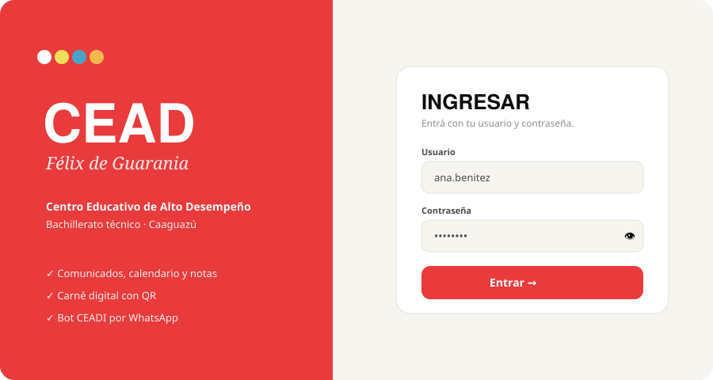
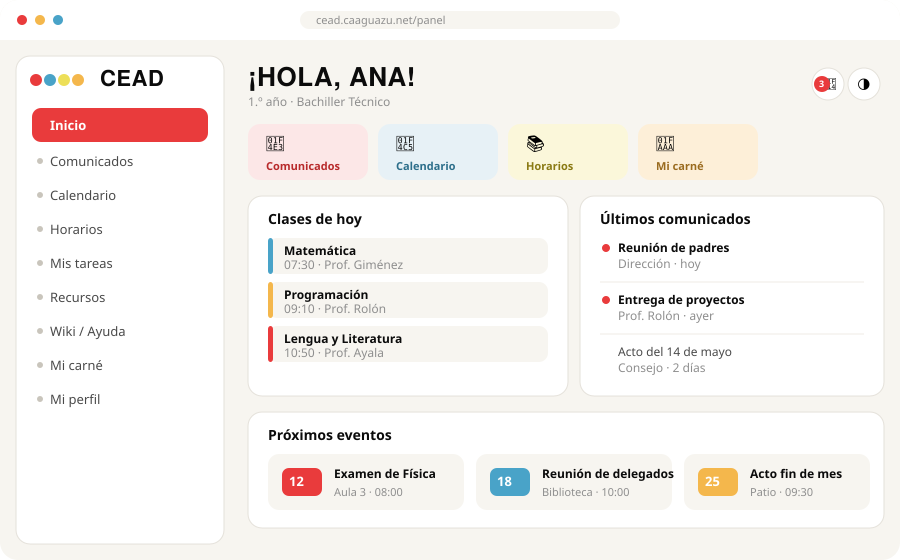
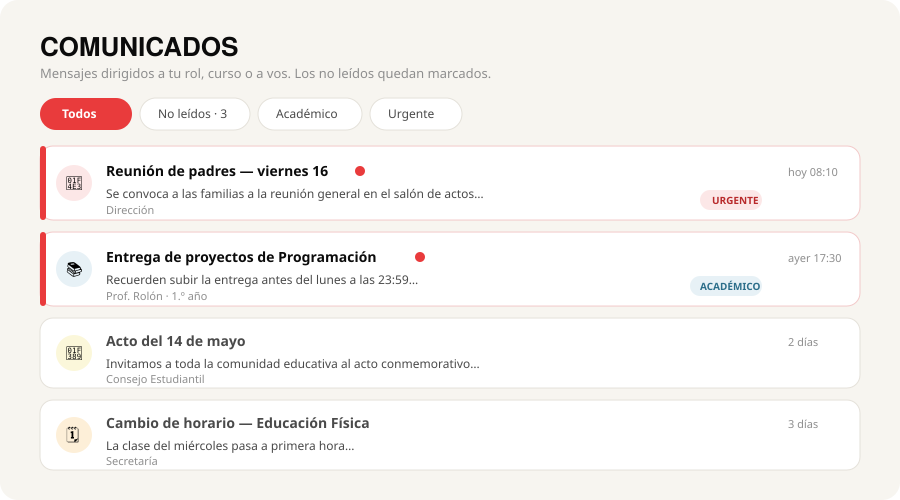
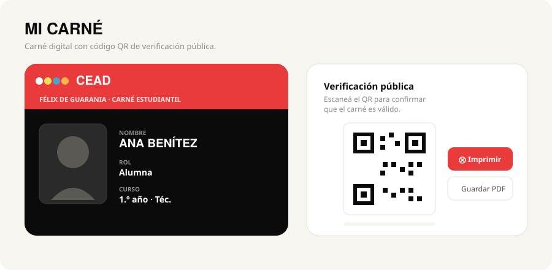
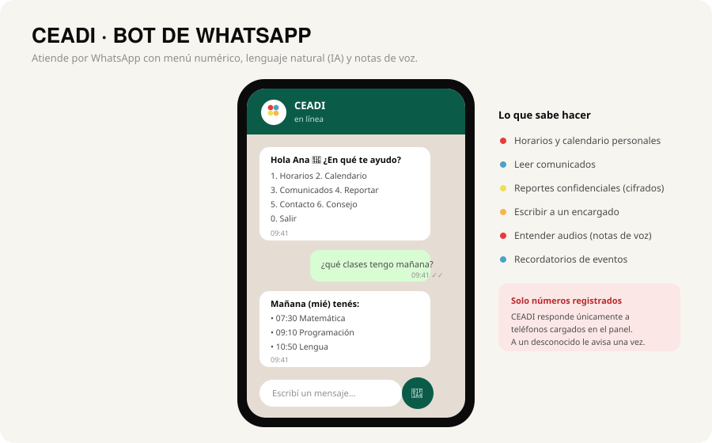

# 📘 CEAD Académico — Wiki del usuario

> Guía completa del sistema del **Centro Educativo de Alto Desempeño "Félix de Guarania"**.
> Versión del plugin: **0.44.0**.

Esta wiki explica **todo lo que tiene el sistema** en lenguaje simple: el panel web, la app, el bot de WhatsApp (CEADI) y la parte de administración. Está pensada para alumnado, familias, docentes, delegados, secretaría, consejo y dirección.

> 📍 Esta wiki se puede leer online en **`/wiki`** del sitio. ¿Buscás la parte técnica (arquitectura, módulos, base de datos, despliegue)? Está en **[Wiki técnica](WIKI-TECNICA.md)**.

---

## 1. ¿Qué es?

CEAD Académico es la plataforma del colegio. Tiene tres caras:

1. **El panel web** (`/panel`) — donde cada persona, según su rol, ve comunicados, calendario, horarios, tareas, recursos, su carné, etc.
2. **CEADI**, el **bot de WhatsApp** — atiende consultas, horarios, eventos, reportes y mensajes desde el celular.
3. **La administración** (wp-admin) — donde dirección y secretaría cargan cursos, usuarios, comunicados, eventos, calificaciones e importan datos.

Se puede usar desde el navegador o **instalarse como app** en el celular (ver §3).

---

## 2. Acceso y cuentas

| Acción | Dirección |
|---|---|
| Ingresar | `/login` |
| Registrarse | Solo con un **link de invitación** que genera la dirección (`/i/<código>`) |
| Recuperar contraseña | `/recuperar` |
| Cerrar sesión | `/salir` |
| Panel | `/panel` |

- **No hay registro libre**: para crear una cuenta hace falta una invitación enviada por la dirección/secretaría.
- En el **login**, si te equivocás, **no se borra** el usuario que escribiste, y hay un botón **👁 para ver la contraseña**.
- Si olvidaste la contraseña, usá *"¿Olvidaste tu contraseña?"* en el login.


*Ilustración de la pantalla de ingreso. La apariencia real puede variar levemente.*

---

## 3. La app (PWA) y preferencias

- **Instalar como app**: en el menú, **"Instalar app"** explica paso a paso cómo agregarla a la pantalla de inicio en **Android (Chrome)**, **iPhone (Safari)** y **PC**. Se abre a pantalla completa, se actualiza sola y no ocupa casi nada. Es gratis.
- **Modo oscuro**: botón 🌗 en la barra superior. Queda guardado en tu dispositivo.
- **Menú**: en celular el menú lateral se abre con el botón ☰; en computadora está siempre visible.
- **Notificaciones** 🔔: la campana junta lo nuevo (comunicados sin leer, próximos eventos, tareas que vencen) con "marcar todo leído".
- **Buscador** 🔍: busca en comunicados, eventos y recursos.

---

## 4. Roles

| Rol | Para qué |
|---|---|
| **Dirección** | Acceso total: cursos, usuarios, invitaciones, comunicados, eventos, calificaciones, importadores, buzón, métricas. |
| **Secretaría** | Casi todo lo administrativo (cursos, invitaciones, comunicados, eventos, importadores, buzón). |
| **Docente** | Comunicados y eventos de sus cursos; carga de notas y tareas. |
| **Delegado/a** | Gestiona las **tareas de su curso**. |
| **Alumno/a** | Comunicados, horarios, calendario, tareas, recursos, carné, boletín (sus notas), escribir al CEAD. |
| **Familia** | Calendario, eventos, comunicados, recursos, tareas a nivel colegio. **No ve calificaciones.** |
| **Consejo Estudiantil** | Recibe y responde **sugerencias** dirigidas al Consejo; puede publicar comunicados. |

> El menú y las secciones que ve cada persona **se adaptan automáticamente** a su rol.

---

## 5. El panel web, sección por sección

### 🏠 Inicio
Tablero con saludo, **accesos rápidos**, **clases de hoy** (del horario del curso), **próximos eventos** y **últimos comunicados**. La primera vez por sesión muestra una breve **intro animada** del logo CEAD.


*Ilustración del panel de inicio. Cada persona ve las secciones de su rol.*

### 📣 Comunicados
Mensajes dirigidos a tu rol, curso o a vos. Marca los **no leídos**. Al abrir uno queda leído.


*Ilustración del feed de comunicados, con filtros y marca de no leídos.*

### ✉️ Escribir al CEAD
Mandá un **mensaje directo** a **Dirección**, **Consejo** o **Administración**. Lo reciben en su **buzón** (con tu nombre) y te responden desde la app. *(También se puede hacer desde el bot — ver §6.)*

### 🗳️ Encuestas
Encuestas dirigidas a vos; las respondés y se registran. (Quien las crea puede ver resultados en la administración.)

### 📚 Horarios
Tu **horario semanal de clases** (materias, horas y docentes) según tu curso. Lo carga la secretaría en cada curso.

### 📅 Calendario
**Eventos** (reuniones, exámenes, actos…) en **vista mensual** o **agenda**. Incluye:
- Navegación por mes y colores por tipo de evento.
- **Sincronizar con el celular**: botón para **Google Calendar** y **Apple/iPhone** (suscripción iCal) — los eventos aparecen y se actualizan solos en tu calendario.
> Los horarios de clases **no** se mezclan acá; están en "Horarios".

### 📝 Mis tareas
Tareas de tu curso con **fecha de vencimiento** (resalta "vence hoy/vencida"), prioridad, **marcar como hecha** y **subir tu entrega** (archivo).

### 📁 Recursos
Biblioteca de materiales (PDFs, enlaces, mapas). Tiene **búsqueda**, **filtros por materia/tipo** y **favoritos** ⭐.

### 🪪 Mi carné
Tu **carné digital** con foto, rol, curso, documento y un **código QR**. Al escanearlo, abre una **página pública de verificación** que confirma que el carné es válido (muestra nombre, rol, curso y foto; **no** expone datos sensibles). Botón para **imprimir / guardar PDF**.


*Ilustración del carné digital y su QR de verificación pública.*

### 👤 Mi perfil
- Cambiar **foto**, **nombre** y **teléfono**.
- **Verificación de WhatsApp**: pedís un **código** que CEADI te manda al WhatsApp, lo ingresás y tu número queda **✅ verificado**.

### 📲 Instalar app
Tutorial para instalar el sistema como app (ver §3).

### 📊 Boletín *(solo alumnado)*
Tus **calificaciones**. Las familias **no** ven esta sección.

### 📨 Buzón *(staff: dirección, secretaría, consejo)*
Bandeja para gestionar **reportes** y **mensajes/sugerencias**:
- **Responder**, **aceptar**, **negar**.
- Marcar un reporte como **"No es un reporte"** (queda registrado como broma/no válido en otra categoría).
- **Papelera**: borrado temporal con **restaurar** o **borrar definitivo**.
- **Categorías**: Administración, Consejo y Dirección. El **Consejo** solo ve lo de su categoría.

### ⭐ Paneles por rol
- **Dirección** y **Secretaría**: accesos a su gestión.
- **Delegado/a**: "Tareas del curso".

---

## 6. CEADI — el bot de WhatsApp

CEADI atiende por WhatsApp. **Solo responde a números registrados** en el panel del CEAD; a un número desconocido le avisa una vez y no entra a los menús.


*Ilustración de una conversación con CEADI por WhatsApp.*

### Dos formas de hablarle
- **Lenguaje natural (IA)**: le escribís como a una persona ("¿qué tengo mañana?", "¿cuándo es la reunión?") y CEADI entiende y responde. Si la dirección lo deja activado, es el modo por defecto.
- **Menú numérico**: el menú clásico de siempre (escribí **menú** para verlo). Podés cambiar entre IA y menú cuando quieras.
- **Notas de voz** 🎤: también podés mandarle un **audio**; CEADI lo **transcribe** y te contesta (puede tardar unos segundos más que un texto).

> **Cómo responde**: CEADI es una herramienta de trabajo, no un chat de compañía. Contesta corto y al grano, sin vueltas. Si algo no puede hacerlo, lo dice en una línea.
>
> **Qué no va a hacer, por más que se lo pidan**: dar datos de otra persona (notas, teléfonos, documentos), repetir claves o contraseñas, ni ampliar permisos porque alguien *diga* ser docente o director. Quién sos lo define **tu número registrado**, no lo que escribas en el chat.

### Menú del alumnado
```
1. Horarios            7. Sugerencias / escribir a un encargado
2. Sitio web           8. Preguntas frecuentes
3. Calendario          9. Consejo Estudiantil
4. Contacto            10. Recordatorios de eventos
5. Comunicados         11. Mi panel web
6. Reportar algo       0. Salir
```
- **Reportar algo (6)**: anónimo o confidencial, con categoría; queda en el **buzón**.
- **Escribir a un encargado (7)**: elegís **Administración / Consejo / Dirección** y tu mensaje cae en el **buzón**.
- Los reportes y mensajes **se gestionan solo en el panel** (no se reenvían a ningún WhatsApp de coordinación).

### Comandos útiles
| Escribí | Hace |
|---|---|
| **volver** | Vuelve un paso atrás |
| **cancelar** | Vuelve al menú principal |
| **bajar** | Reenvía el menú al final del chat |
| **baja** | Deja de recibir mensajes (opt-out) |

> Para no llenar el chat, CEADI **edita el mismo mensaje** mientras te guía (durante unos minutos) y baja un mensaje nuevo recién con tu próxima respuesta.

### Para staff (según rol)
Dirección/Secretaría/Docente pueden, desde el bot: enviar **comunicados**, **agregar eventos**, **crear invitaciones** para sumar gente, **cargar notas**, **consultar las notas de un curso**, ver el **panorama** del colegio, gestionar **artículos**, **asignar roles** a un número y usar **atajos**.

> **Docentes — cargar una nota por chat**: alcanza con decirle a CEADI *"ponele 4 a Pérez en Matemática del segundo periodo"*. CEADI busca al alumno **dentro de tu curso**, muestra la nota anterior si ya había una, y **recién guarda cuando aceptás**. Si hay dos apellidos parecidos, pregunta en vez de adivinar. Cada docente solo puede tocar **sus** cursos.
>
> **No hace falta que saques la cuenta**: podés decirle el **porcentaje** (*"sacó 75%"*) o el **puntaje** (*"45 de 60"*) y CEADI convierte a la escala del colegio (1 a 5), mostrándote de dónde salió el número. Avisa si la nota deja **aplazado/a** al alumno, y rechaza los imposibles (más puntos que el total, o un porcentaje dictado como si fuera nota).

### 📄 Docentes — mandar la planilla de notas

No hace falta cambiar tu forma de trabajar: **mandale a CEADI por WhatsApp la misma planilla que ya usás** (`.xlsx` o `.csv`), si querés con un texto tipo *"notas de Matemática, 2º periodo"*.

CEADI la lee, se da cuenta de cómo está armada (qué columna tiene los nombres y cuál las notas), y te muestra un resumen antes de tocar nada: cuántos alumnos reconoció, la muestra de las primeras notas, **cuáles va a saltear y por qué** (alguien que no está en el curso, una celda vacía, un nombre repetido) y cuántos quedan aplazados. Recién carga cuando aceptás.

- Entiende notas, **porcentajes** y **puntajes** (`45/60` o `75%` dentro de la celda).
- **El archivo no se guarda**: se lee, se usa y se descarta. Queda disponible un rato solo para que puedas **preguntarle cosas** — *"¿cuántos aprobaron?"*, *"¿cuál es el promedio?"* — sin que nada se cargue al sistema.
- Si tu planilla es un **Excel viejo (`.xls`)**, abrila y usá *Guardar como → `.xlsx`*.
- Si el archivo tiene **varias hojas**, lee la primera y te avisa.

Si usan el modo IA, pueden pedir estas acciones en lenguaje natural ("mandá un comunicado a todos avisando que…", "creá una invitación para un profe") y CEADI **pide confirmación antes de ejecutar** (aprobación humana). Cada acción respeta el permiso del rol.

> **Crear invitaciones por chat**: dirección/secretaría pueden pedirle a CEADI *"creá un link de alumno para 30 personas"* y, tras aprobar, reciben **un solo link de registro reutilizable** esa cantidad de veces. Por seguridad, **solo** se pueden crear invitaciones de **alumno, delegado o profe** (nunca de dirección o secretaría). Los links de **delegado** vencen al año; el resto, a los ~3 años.

---

## 7. Administración (wp-admin)

Acceso para dirección/secretaría desde `wp-admin`. El **Escritorio** tiene estética CEAD con **métricas** (alumnos, docentes, cursos, eventos próximos, altas del mes y estado del bot) y accesos rápidos.

| Sección | Para qué |
|---|---|
| **Usuarios** | Crear usuarios, asignar rol y teléfono. |
| **Invitaciones** | Generar links de invitación para sumar gente. |
| **Cursos** | Crear cursos, asignar delegado/tutor/alumnado y **cargar el horario semanal** (día, hora, materia, docente). |
| **Comunicados** | Publicar comunicados dirigidos a rol, curso o personas. |
| **Encuestas** | Crear encuestas y ver resultados. |
| **Eventos** | Reuniones, exámenes, actos del calendario. |
| **Recursos** | Subir materiales pedagógicos. |
| **Tareas (delegado)** | Tareas asignadas a cursos. |
| **Importadores** | Cargar por archivo CSV/Excel: **Alumnado, Calificaciones, Cursos, Horarios/eventos**. ⚠️ **Solo desde computadora** (en celular está bloqueado por ser poco fiable). |
| **WhatsApp** | Estado del bridge, comunicados por WA, reportes, métricas, mensaje directo y **perfil de CEADI**. |
| **Actualizaciones** | Ver/actualizar la versión del plugin (ver §9). |

---

## 8. Familias

Las familias entran al panel y ven **calendario, eventos, comunicados, recursos y tareas** a nivel colegio. **No ven calificaciones**, para evitar conflictos.

---

## 9. Actualizaciones del sistema

El plugin se **actualiza solo desde GitHub**: cuando hay una versión nueva, aparece en **Plugins → Actualizaciones** (o en *CEAD Académico → Actualizaciones*) y se instala con un clic. Requiere un **token de GitHub** cargado (en *Actualizaciones* o en `wp-config.php`). Hay un botón **"Probar conexión con GitHub"** para diagnosticar.

---

## 10. Preguntas frecuentes

**No me aparece "Instalar app".**
Abrilo desde el navegador (Chrome/Safari), no desde un link dentro de Instagram/WhatsApp. En iPhone tiene que ser con Safari.

**Cambié algo y no se ve.**
Cerrá y reabrí el panel/app; toma la última versión al cargar con internet.

**CEADI no me responde.**
Tu número tiene que estar **registrado** en el panel. Verificá tu teléfono en *Mi perfil* o pedí a la dirección que lo registre.

**Soy familia y no veo el boletín.**
Es a propósito: las familias no acceden a calificaciones.

**¿Dónde reporto algo o escribo a la dirección?**
Desde el panel en **"Escribir al CEAD"**, o desde CEADI (opciones 6 y 7). Todo llega al **buzón**.

---

*CEAD Académico · Félix de Guarania.*
